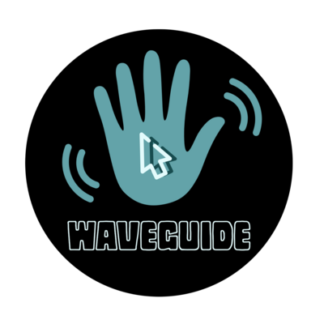

# WaveGuide
<br/>
<p align="center">

  </p>
<br/>

## CONTRIBUTORS : 


<!-- 
 -->
<br>

WaveGuide is a utility that allows you to control the cursor using hand gestures. It uses a Raspberry Pi camera module to capture your hand movements and translates them into cursor actions. You can perform various operations such as moving, clicking, dragging, scrolling and more with simple gestures.

WaveGuide is developed by a team of four students from the University of Glasgow as a part of their ENG502X Real-time Embedded Programming project. It uses OpenCV for image processing and X11 for cursor manipulation. It runs on Raspberry Pi 4B with Raspbian OS (based on Debian Buster).

## Dependencies

To build and run waveGuide, you need the following dependencies:

- CMake (2.8 or greater)
- OpenCV (4.5 or greater)
- X11 library
- XTest Extention

- To do anything further, clone this repository to your Raspberry Pi using the `git clone` command or by downloading the repository as a .zip file.
```
>$ git clone https://github.com/jeasonmaliyekkal/WaveGuide.git
```

- Navigate to the 'WaveGuide' directory.
```
>$ cd WaveGuide
```
- Make the ``` install_dependencies.sh ``` executable.
```
>$ chmod +x install_dependencies.sh
```
- Now run the executable.
```
>$ ./install_dependencies.sh
```

<br>

## Installation

- Navigate to the 'WaveGuide' directory. 
 ``` 
 >$ cd WaveGuide
  ```
- Create a build directory and navigate to it.
```
>$ mkdir build 
>$ cd build
```
- Run `cmake ..` to generate the Makefile
- Run `make` to compile the source code
- Run `./main` to start the program
```

>$ cmake ..
>$ make
>$ ./main 
```
## Demonstration (Video)
### 1. Hand Detection 
### 2. Cursor Tracking
### 3. CLicking and Misc.

## Usage

To use waveGuide, you need to attach a Raspberry Pi camera module to your device and point it towards your hand. Make sure there is enough light and contrast in the background.

You can perform the following gestures to control the cursor:

- Move your open palm hand left, right, up or down to move the cursor accordingly
- Hold 2 fingers to click the left mouse button
- Open your palm to release the left mouse button
- Hold 3 fingers to click the right mouse button
- Open palm to release the right mouse button
- Swipe your hand horizontally to scroll horizontally
- Swipe your hand vertically to scroll vertically

## Schematic Diagram


## Documentation

## Limitations

waveGuide currently works only on X11 window system. Wayland support will be added in the future.

waveGuide is still in development and may have some bugs or errors. Please report any issues or feedback on GitHub. Or just call Jeason. Njan phone edukkilla.

## Scope and Future Work

## Social Media
 [](<https://twitter.com/WaveGuide20>) <br>
 [](<https://instagram.com/waveguide._>)


